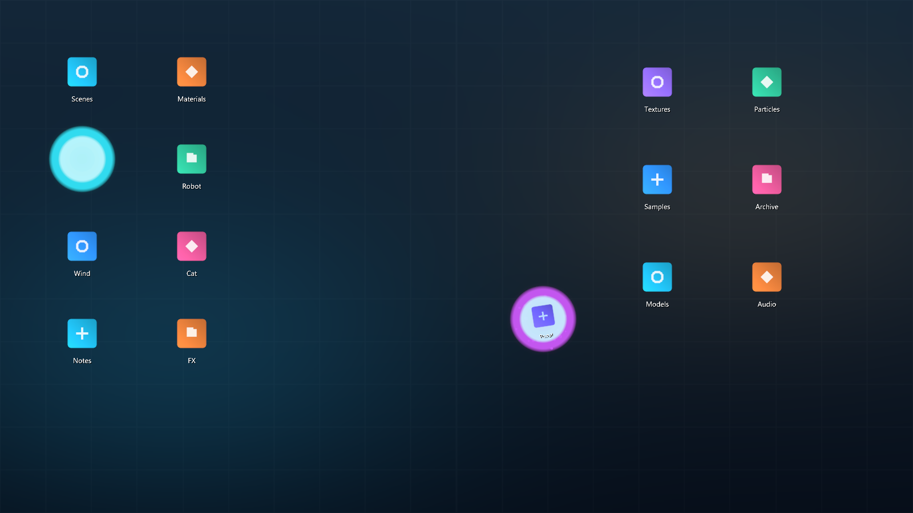
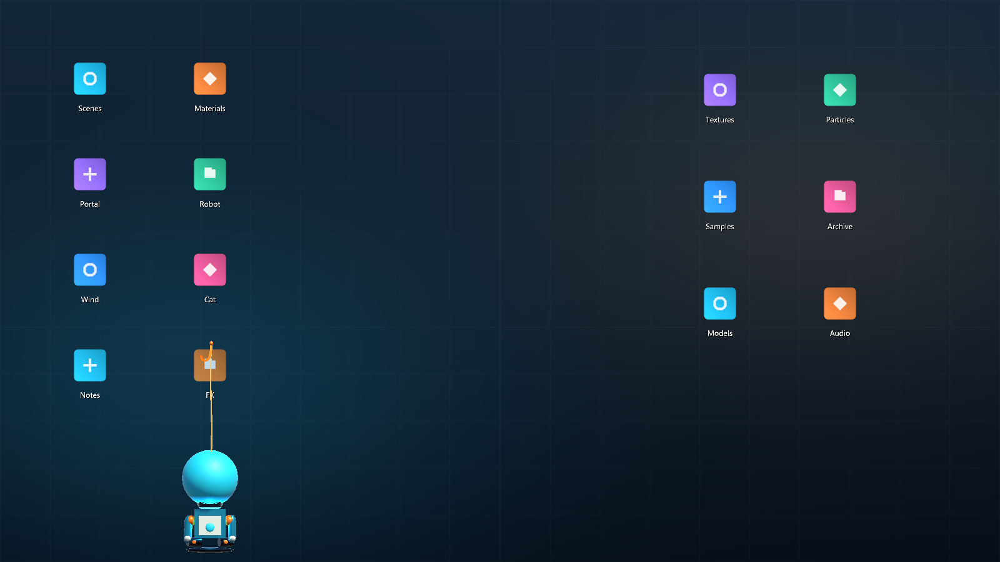
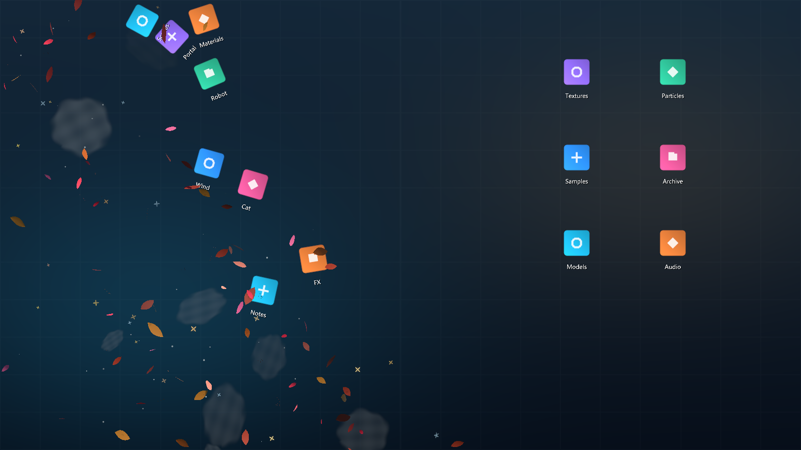
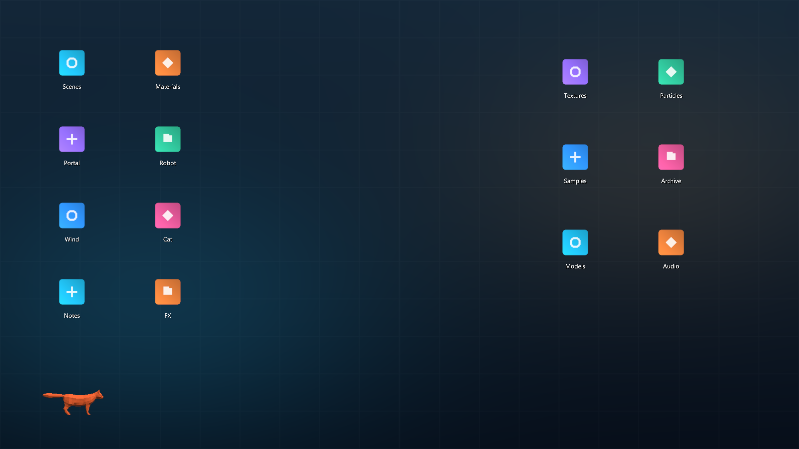
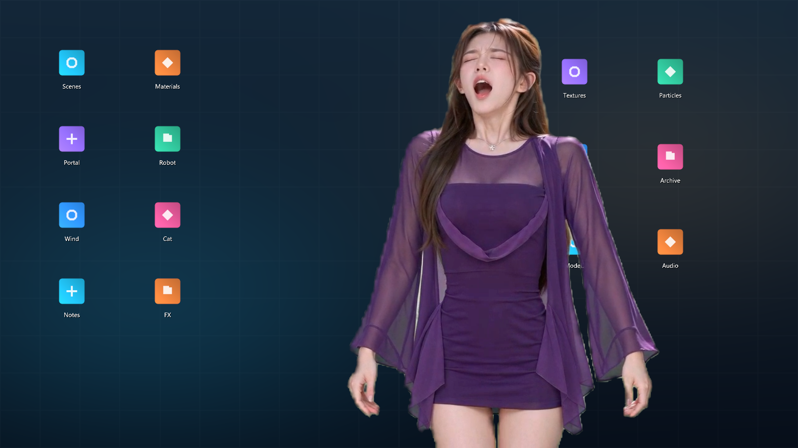

# Unity Desktop FX

基于 **Unity 6 / URP** 的桌面特效实验仓库。每个效果都可以单独触发：传送门、钩索机器人、秋风粒子、潜行猫咪，以及可选的真人视频表演。运行时用 Unity 图标代理参与动画和物理模拟；Windows 桌面适配器是演示目标之一，不是必需的特效制作工具。

> 下方图片全部由**实际运行的 Unity Player**在内置合成桌面场景中截取。演示场景使用程序生成的背景与虚构图标，不包含用户真实桌面、文件名或壁纸。

## 效果预览

### 传送门 · `Ctrl+Alt+P`

入口吸入图标，另一处的出口将图标送回桌面。



### 钩索机器人 · `Ctrl+Alt+M`

程序化 3D 机器人从屏幕底部移动，用钩索抓取代理图标。



### 秋风粒子 · `Ctrl+Alt+T`

随机 360° 来向的湍流风场驱动落叶、花瓣、星芒及空气粒子；图标受风后参与物理模拟。



### 潜行猫咪 · 空闲触发（实验效果）

带骨骼的 3D 猫咪从屏幕边缘探出，悄悄靠近图标；检测到输入时受惊撤退。



### 真人视频表演 · `Ctrl+Alt+S`（可选素材）

人物喷嚏、捡拾与恢复图标由分段视频和图标事件时间线配合完成。此模式需要 `INTERACTIVE_WALLPAPER_ENABLE_HUMAN=1`；仓库所有者表示视频素材具备公开分发权限，来源与上游授权说明见 [THIRD_PARTY_NOTICES.md](THIRD_PARTY_NOTICES.md)。



## 运行方式

### 无隐私数据的独立演示

演示模式**不调用桌面 Shell 快照，不附着 Explorer，也不会打开演示图标对应的真实文件**。在仓库根目录的 PowerShell 中执行：

```powershell
$env:INTERACTIVE_WALLPAPER_SHOWCASE = '1'
& .\out\unity-player\InteractiveWallpaper.exe
```

进入合成桌面后，可按 `Ctrl+Alt+P/M/T` 分别触发传送门、机器人和秋风。`Ctrl+Alt+H` 切换状态面板，`Ctrl+Alt+R` 复位代理图标，`Ctrl+Alt+Q` 退出。

用实际 Player 自动重拍某个效果的截图（效果名可取 `portal`、`robot`、`wind`、`cat`、`human`）：

```powershell
$env:INTERACTIVE_WALLPAPER_SHOWCASE = '1'
$env:INTERACTIVE_WALLPAPER_SHOWCASE_EFFECT = 'portal'
$env:INTERACTIVE_WALLPAPER_SHOWCASE_CAPTURE_DIR = (Join-Path (Get-Location) 'media\showcase')
& .\out\unity-player\InteractiveWallpaper.exe
```

Player 会等待演示图标就绪、触发对应效果、截图并退出。`cat` 和 `human` 属于仍在迭代的实验素材。

### Windows 真实桌面模式

不设置 `INTERACTIVE_WALLPAPER_SHOWCASE` 时，程序通过进程内 Native DLL 读取 Explorer 项目、图标和布局，并把 Unity 窗口附着到桌面层。所有运动只影响 Unity 代理；**不会自动移动、删除或重命名真实桌面文件**。直接运行 `InteractiveWallpaper.exe` 即可，退出快捷键为 `Ctrl+Alt+Q`。目前针对 Windows x64 验证，多屏、DPI、Explorer 重启与不同系统版本仍需实机测试。

## 从源码构建

需要 Windows x64、Visual Studio 2022 C++ 工具链、CMake 3.25+、Unity Editor **6000.6.1f1** 与 Windows Build Support (IL2CPP)。Unity 工程位于 `unity/InteractiveWallpaper3D/`。

```powershell
cmake -S . -B out/build -G "Visual Studio 17 2022" -A x64 `
  -DINTERACTIVE_WALLPAPER_UNITY_EDITOR_EXECUTABLE="C:/Program Files/Unity 6000.6.1f1/Editor/Unity.exe"
cmake --build out/build --config Release

$env:INTERACTIVE_WALLPAPER_UNITY_BUILD_OUTPUT = (Join-Path (Get-Location) 'out\unity-player\InteractiveWallpaper.exe')
& "C:\Program Files\Unity 6000.6.1f1\Editor\Unity.exe" -batchmode -nographics -quit `
  -projectPath (Join-Path (Get-Location) 'unity\InteractiveWallpaper3D') `
  -executeMethod InteractiveWallpaper.Editor.RuntimeBuild.BuildWindowsRuntime `
  -logFile (Join-Path (Get-Location) 'out\unity-build.log')
```

运行时应复制整个 `out/unity-player/` 目录，包括 `InteractiveWallpaper.Native.dll`、`GameAssembly.dll` 和 `InteractiveWallpaper_Data/`；不要把 Debug Native DLL 用于其他电脑。

本地 CTest 入口：

```powershell
ctest --test-dir out/build -C Release --output-on-failure
```

## 目录

- `unity/InteractiveWallpaper3D/Assets/InteractiveWallpaper/Runtime/`：独立效果、演示场景、代理图标与输入；
- `native/Native/`：仅供 Windows 真实桌面模式使用的 Shell 桥接；
- `models/`：保留的外部模型原件；实际运行资源已放在 Unity 的 `Resources/` 和 `StreamingAssets/`；
- `media/showcase/`：由实际 Player 输出的效果截图；
- `tests/`：构建与运行验证脚本。

## 许可与素材

本仓库自有的 C#/C++ 代码、脚本、文档和演示截图按 **GPL-3.0-only** 发布，完整条款见 [LICENSE](LICENSE)（仅 GPL 3.0，不自动授权后续版本）。第三方模型与图形素材继续遵守各自的 CC BY 4.0 / CC0 等许可，作者、来源与改动见 [THIRD_PARTY_NOTICES.md](THIRD_PARTY_NOTICES.md)，不能因为位于本仓库就视作重新授权为 GPL。

Unity Editor 和 Unity Runtime 是独立的专有组件，不属于本仓库 GPL 授权范围。`out/` 构建产物不纳入 Git；**源码开源不等于已确认包含 Unity Runtime 的可执行文件可以按 GPL 整体再分发**。如要上传编译后的 Player，请先核对 Unity 条款与 GPL 的组合分发条件。
